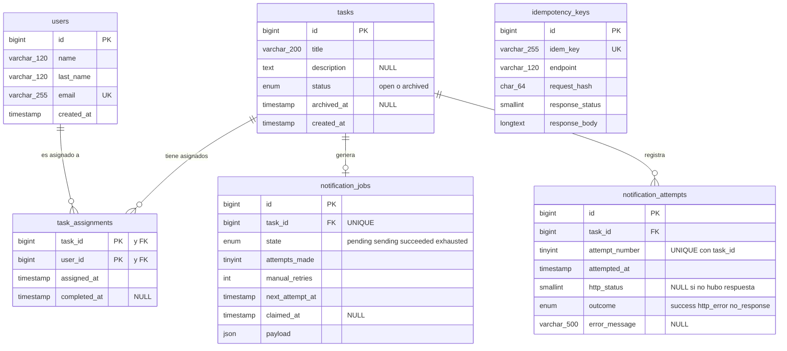

# Modelo de datos

Diagrama entidad-relación con tipos y relaciones. El esquema versionado que lo produce está en
[`../migrations/`](../migrations/).

## Las restricciones que cargan peso

Tres restricciones cargan peso: la PK compuesta de `task_assignments` hace imposible duplicar una
asignación, el `UNIQUE` de `notification_jobs.task_id` sostiene "notificar exactamente una vez", y el
`UNIQUE` de `idem_key` es el mutex de toda la idempotencia.

Con detalle:

| Restricción | Qué garantiza |
|---|---|
| `task_assignments` PK `(task_id, user_id)` | Imposible duplicar una asignación, aunque lleguen dos peticiones idénticas a la vez. No hace falta comprobarlo en código. |
| `notification_jobs` UNIQUE `(task_id)` | Una tarea no puede tener dos trabajos de notificación, así que "notificar exactamente una vez" sobrevive a caídas y a completaciones concurrentes. |
| `notification_attempts` UNIQUE `(task_id, attempt_number)` | Imposible registrar dos veces el intento N. Por eso el número de intento es monótono entre ciclos de reenvío, en vez de reiniciarse. |
| `idempotency_keys` UNIQUE `(idem_key)` | El mutex de toda la idempotencia: el `INSERT` perdedor espera al ganador en vez de fallar de inmediato. |
| `users` UNIQUE `(email)` | Decide el email repetido sin una consulta previa que perdería la carrera. |
